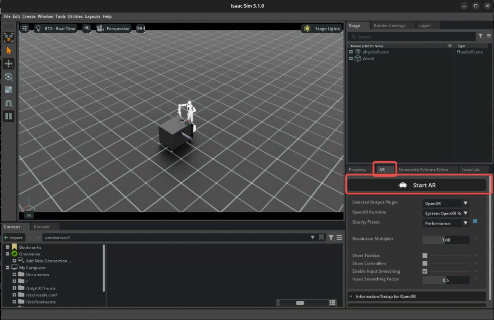

| 输出 | 录制数据默认写入 `--dataset_file` 指定的 HDF5；若希望宿主机直接可见，可把路径设到 `/workspace/host/out/...` |# Isaac Lab Teleop - 录制遥操作数据（完整流程）

## 版本信息

| 组件 | 版本 |
|------|------|
| Isaac Lab | 2.3.2 |
| CloudXR Runtime | 6.0.1-webrtc |
| CloudXR JS Client | 6.0.2-beta-pid |
| Node.js | v24.12.0 |
| npm | v11.6.2 |
| Dockerfile | `Dockerfile.2.3.2` |
| 镜像 Tag | `isaac-lab-teleop:2.3.2` |
| 文档内任务 | 任务一：`Isaac-PickPlace-GR1T2-Abs-v0`；任务二：`Isaac-Stack-Cube-Galbot-Left-Arm-Gripper-Visuomotor-v0`；任务三：`Isaac-Stack-Cube-Franka-IK-Abs-v0`（motion controllers）；任务四：`Isaac-G1-Dex1-FixedBase-StackCube-Reachability-v0`（G1 Dex1 + Pico motion controllers） |
| 遥操设备 | handtracking / **`motion_controllers`**（Pico 4 Ultra 手柄位姿 + trigger 夹爪；任务三为右手 Franka，任务四为 G1 Dex1 双手） |

---

## 1. 服务端环境准备

### 1.1 安装 Node.js

Pico 4 Ultra 的 WebXR 浏览器要求 HTTPS 连接，需要在服务端运行 cloudxr-js 的 dev-server。先确认 Node.js 已安装：

```bash
npm -v    # 期望: 11.6.2
node -v   # 期望: v24.12.0
```

如未安装，参考 [Node.js 官方安装指南](https://nodejs.org/) 安装对应版本。

### 1.2 安装 cloudxr-js 客户端依赖

进入 cloudxr-js 解压目录，安装依赖。

### 1.3 配置 WSS 代理 (HAProxy)

Pico 4 Ultra 的浏览器强制要求 HTTPS，因此需要一个 WSS 代理将 `wss://` 请求转发到 CloudXR Runtime 的 `ws://49100` 端口。

推荐使用 cloudxr-js 文档中的 HAProxy Docker 方案，参考：

> `cloudxr-js-early-access_6.0.2-beta-pid/release/docs/documents/Networking_Setup.html`
> 章节: *Example 1: Development proxy (Docker / HAProxy)*

---

## 2. 构建并启动 Isaac Lab 容器

### 2.1 构建镜像

```bash
cd INTERNAL_examples/isaac-lab-teleop/single-container
docker build -f Dockerfile.2.3.2 -t isaac-lab-teleop:2.3.2 .
```

### 2.2 宿主机：开放 X11（启动容器前执行）

容器内 Isaac Sim 使用宿主机的 `DISPLAY`，需允许本机上的连接（含 root / Docker）。**在执行下一小节的 `docker run` 之前**，在宿主机终端执行：

```bash
xhost +local:
```

用完后若希望收紧权限，可在宿主机执行 `xhost -local:`（按需）。是否使用 `xhost` 请结合本机安全策略；若未开放，可能出现无法打开窗口、`X11 connection refused` 等问题。

### 2.3 启动容器与 [yujie-dev](https://github.com/billamiable/IsaacLab/tree/yujie-dev) 代码

镜像自带的是上游 Isaac Lab。这里统一使用 bind mount，让容器直接使用本机 `yujie-dev` 代码；保存代码后容器内立即生效。

需要准备两个宿主机路径：

- `ISAAC_HOST`：本机 Isaac Lab 仓库根目录，挂载到 `/workspace/isaaclab`。
- `TELEOP_OUT`：宿主机输出目录，挂载到 `/workspace/host/out`。

```bash
export ISAAC_HOST="<your_isaaclab_repo_path>"
mkdir -p ./out
export TELEOP_OUT="$PWD/out"
```

容器默认 CMD 为 `sleep infinity`，启动后 CloudXR 会自动运行，不会自动跑遥操作脚本。

**开发持久模式**：

```bash
docker run -d \
  --net host \
  --runtime nvidia \
  --gpus all \
  -e ACCEPT_EULA=Y \
  -e DISPLAY=$DISPLAY \
  -e OMNI_KIT_ALLOW_ROOT=1 \
  -v /tmp/.X11-unix:/tmp/.X11-unix:rw \
  -v isaac-cache-kit-232:/isaac-sim/kit/cache \
  -v isaac-cache-ov-232:/root/.cache/ov \
  -v "${ISAAC_HOST}:/workspace/isaaclab" \
  -v "${TELEOP_OUT}:/workspace/host/out" \
  --name isaac-lab-232 \
  isaac-lab-teleop:2.3.2
```

适合开发阶段反复 `docker exec` 跑脚本、生成视频或进入容器调试。如需清理：

```bash
docker stop isaac-lab-232
docker rm isaac-lab-232
```

**实机 Pico 干净模式**：

```bash
docker run --rm -it \
  --net host \
  --runtime nvidia \
  --gpus all \
  -e ACCEPT_EULA=Y \
  -e DISPLAY=$DISPLAY \
  -e OMNI_KIT_ALLOW_ROOT=1 \
  -v /tmp/.X11-unix:/tmp/.X11-unix:rw \
  -v isaac-cache-kit-232:/isaac-sim/kit/cache \
  -v isaac-cache-ov-232:/root/.cache/ov \
  -v "${ISAAC_HOST}:/workspace/isaaclab" \
  -v "${TELEOP_OUT}:/workspace/host/out" \
  --name isaac-lab-232 \
  isaac-lab-teleop:2.3.2
```

`--rm -it` 适合真实设备测试前从干净容器启动；退出后容器会自动删除，不能再 `docker exec` 复用。

**命名卷**：`isaac-cache-kit-232` -> `/isaac-sim/kit/cache`；`isaac-cache-ov-232` -> `/root/.cache/ov`，持久化缓存。

**DISPLAY / GUI**：依赖 **2.2** 的 `xhost`。任务二 **`handtracking` + `--enable_cameras`** 勿再加 `--headless`。`OMNI_KIT_ALLOW_ROOT=1` 供 root 跑 Kit。

**建立 `_isaac_sim`（每个新容器执行一次）**

```bash
docker exec -it isaac-lab-232 /bin/bash
cd /workspace/isaaclab
ln -sfn /isaac-sim _isaac_sim
test -f _isaac_sim/VERSION && head -n1 _isaac_sim/VERSION
```
等待 CloudXR 就绪：

```text
The NVIDIA(TM) CloudXR(TM) Runtime service has started.
```

---

## 3. 配置服务端防火墙

Pico 4 Ultra 使用 HTTPS/WSS 模式连接，需要开放以下端口：

```bash
# CloudXR Runtime 信令端口 (WebRTC)
sudo ufw allow 49100/tcp

# CloudXR Runtime 媒体流端口范围 (UDP)
sudo ufw allow 47998:48012/udp

# WSS 代理端口 (HTTPS 模式)
sudo ufw allow 48322/tcp
```

端口说明：

| 端口 | 协议 | 用途 |
|------|------|------|
| 49100 | TCP | CloudXR WebRTC 信令 |
| 47998-48012 | UDP | CloudXR 媒体流传输 |
| 48322 | TCP | WSS 代理 (SSL 加密信令) |

---

## 4. 启动 WSS 代理

按照步骤 1.3 构建好 HAProxy 镜像后，启动 WSS 代理容器：

```bash
docker run -d --name wss-proxy \
  --network host \
  -e BACKEND_HOST=localhost \
  -e BACKEND_PORT=49100 \
  -e PROXY_PORT=48322 \
  websocket-ssl-proxy
```

| 环境变量 | 值 | 说明 |
|---------|-----|------|
| `BACKEND_HOST` | localhost | CloudXR Runtime 地址 |
| `BACKEND_PORT` | 49100 | CloudXR WebRTC 信令端口 |
| `PROXY_PORT` | 48322 | WSS 对外暴露端口 |

---

## 5. 启动 HTTPS Dev Server

在服务端另开一个终端，启动 cloudxr-js 的 HTTPS dev server：

```bash
cd <cloudxr-js-early-access_6.0.2-beta-pid 解压目录>
cd isaac
npm run dev-server:https
```

此时 Pico 4 Ultra 可以通过浏览器访问 `https://<服务器IP>:<端口>` 连接到 CloudXR。

---

## 6. 进入容器并按任务运行遥操作

另开一个终端，exec 进入容器：

```bash
docker exec -it isaac-lab-232 /bin/bash
```

**前提**：已按 **2.2** 开放 X11；已按 **2.3** 启动容器（含 `DISPLAY`）。须完成 **`ln -sfn` -> `_isaac_sim`**。GUI 与 headless 见 **2.3**。

**Headless 与任务对应关系**：

- **任务一（GR1 PickPlace）**：`record_demos` 示例带 `--headless`（该任务默认不录相机观测时可常用）。若出现与 **2.3** 类似的 XR /渲染报错，可去掉 `--headless` 改走 GUI。
- **任务二（Galbot Visuomotor）**：需 **`--enable_cameras`** 写入图像，**不要**加 `--headless`（见 **2.3**）。
- **任务三（Franka IK Abs + motion controllers）**：与任务一类似走 **`--headless`** 即可；无需 `--enable_pinocchio`（微分 IK）。
- **任务四（G1 Dex1 + motion controllers）**：先以 pipeline 联调为主，走 **`--headless`**，但必须加 **`--enable_pinocchio`**（Pink IK）。

以下命令均在容器内 `/workspace/isaaclab` 执行（`./isaaclab.sh`）。

### 任务一：`Isaac-PickPlace-GR1T2-Abs-v0`

#### 仅遥操（不录制）

```bash
./isaaclab.sh -p scripts/environments/teleoperation/teleop_se3_agent.py \
  --task Isaac-PickPlace-GR1T2-Abs-v0 \
  --teleop_device handtracking \
  --enable_pinocchio \
  --info
```

#### 录制 HDF5

```bash
./isaaclab.sh -p scripts/tools/record_demos.py \
  --task Isaac-PickPlace-GR1T2-Abs-v0 \
  --teleop_device handtracking \
  --enable_pinocchio \
  --info \
  --headless \
  --dataset_file ./datasets/pickplace_gr1t2_handtracking.hdf5 \
  --num_demos 0 \
  --num_success_steps 10
```

### 任务二：`Isaac-Stack-Cube-Galbot-Left-Arm-Gripper-Visuomotor-v0`（录制含相机）

运行前须已按 **2.3** 使用 bind mount 让容器内代码为 [yujie-dev](https://github.com/billamiable/IsaacLab/tree/yujie-dev)，并完成 `_isaac_sim` 链接。

Galbot RmpFlow 相对模式需设置 `USE_RELATIVE_MODE`；显式指定 GPU 与渲染质量，并开启相机写入观测。

```bash
USE_RELATIVE_MODE=true ./isaaclab.sh -p scripts/tools/record_demos.py \
  --device cuda:0 \
  --task Isaac-Stack-Cube-Galbot-Left-Arm-Gripper-Visuomotor-v0 \
  --teleop_device handtracking \
  --enable_cameras \
  --info \
  --rendering_mode quality \
  --dataset_file ./datasets/galbot_left_visuomotor_handtracking.hdf5 \
  --num_demos 0 \
  --num_success_steps 10
```

**任务二为非 headless，会弹出 Isaac Sim 主窗口。** 使用 `handtracking` 前，需在界面里手动进入 XR（与下图一致）：

1. 在窗口**底部面板**选中 **「AR」** 标签页。  
2. 确认 **Selected Output Plugin** 为 **OpenXR**（**OpenXR Runtime** 一般为系统运行时）。  
3. 点击 **「Start AR」**（带头显图标的大按钮），启动后再用 Pico 浏览器连接 CloudXR 进行手部追踪。



| 参数 | 说明 |
|------|------|
| `--dataset_file` | 录制 HDF5 在容器内的保存路径（导出见第 7 节） |
| `--num_demos 0` | 不限制 demo 条数，手动结束 |
| `--num_success_steps 10` | 连续10 步满足成功条件后判定当前 demo 成功 |
| `--enable_cameras` | **任务二**需要，用于 policy 观测中的 RGB（及录制进 HDF5） |

通过 Pico 4 Ultra 连接 CloudXR 后即可手部追踪遥操作；**原始录制**落在容器内 `./datasets/*.hdf5`。需要 MP4 时可在容器内再跑 **9.2** 的脚本，输出到例如 `./videos_for_cosmos/`。

### 任务三：`Isaac-Stack-Cube-Franka-IK-Abs-v0`（右手柄 + 扳机夹爪）

[yujie-dev](https://github.com/billamiable/IsaacLab/tree/yujie-dev) 在 **`stack_ik_abs_env_cfg`** 中增加了与 Isaac Lab 3 / IsaacTeleop **语义对齐** 的 **`motion_controllers`** 设备：`OpenXRDeviceCfg` + 右手控制器绝对位姿（Se3Abs）+ **扳机优先、手部 pinch 兜底** 的夹爪逻辑（无需 Pink / `--enable_pinocchio`）。同一任务仍保留 **`handtracking`** 设备键。

| 项目 | 说明 |
|------|------|
| 手柄 | **右手**（`CONTROLLER_RIGHT`）驱动末端绝对位姿 |
| 夹爪 | **右手扳机（trigger）**：按下超过默认阈值（0.5）闭合；未超过张开；无手柄数据时退化为右手 pinch |
| 叠加方块顺序 | 底层蓝 `cube_1`、中层红 `cube_2`、顶层绿 `cube_3`（成功判定按实体名，非颜色分类算法） |

#### 录制 HDF5（motion controllers）

```bash
./isaaclab.sh -p scripts/tools/record_demos.py \
  --task Isaac-Stack-Cube-Franka-IK-Abs-v0 \
  --teleop_device motion_controllers \
  --info \
  --headless \
  --dataset_file ./datasets/franka_stack_cube_ik_abs_motion_controllers.hdf5 \
  --num_demos 0 \
  --num_success_steps 10
```

---

### 任务四：`Isaac-G1-Dex1-FixedBase-StackCube-Reachability-v0`（G1 Dex1 + Pico 双手柄）

该任务用于 G1 Dex1 的 Pico motion-controller 录制。场景是固定下半身 G1 Dex1、table、3 个 Nucleus block；左/右 Pico controller 分别控制左/右 wrist，左右 trigger 分别控制左右 Dex1 gripper。

| 项目 | 说明 |
|------|------|
| 资产 | 默认读取 `/workspace/isaaclab/docs/g1_dex1_assets/`，包含 v4 仿真 USD、Pink IK URDF、必要 USD composition 依赖和 URDF mesh；详见 `docs/g1_dex1_assets/README.md` |
| 输出 | 录制数据默认写入 `--dataset_file` 指定的 HDF5；若希望宿主机直接可见，可把路径设到 `/workspace/host/out/...` |
| XR 高度 | 若进入后机器人过高/过低，优先调 `g1_dex1_fixed_base_ik_scene_env_cfg.py` 中的 `XrCfg(anchor_pos=(0.0, 0.0, ...))` |
| 成功判定 | 当前 success 是真堆叠：`cube_2` 叠到 `cube_1`、`cube_3` 叠到 `cube_2`，且 gripper joints 处于 open；未满足时可遥操但不会导出成功 demo |

启动前确认资产可见：

```bash
docker exec isaac-lab-232 test -f /workspace/isaaclab/docs/g1_dex1_assets/g1_29dof_dex1_1_v4_test_good.usd
docker exec isaac-lab-232 test -f /workspace/isaaclab/docs/g1_dex1_assets/g1_29dof_mode_15_with_dex1_1.urdf
docker exec isaac-lab-232 test -d /workspace/isaaclab/docs/g1_dex1_assets/meshes
```

容器内 `/workspace/isaaclab` 执行：

```bash
./isaaclab.sh -p scripts/tools/record_demos.py \
  --task Isaac-G1-Dex1-FixedBase-StackCube-Reachability-v0 \
  --teleop_device motion_controllers \
  --enable_pinocchio \
  --device cuda:0 \
  --headless \
  --info \
  --dataset_file ./datasets/g1_dex1_pico_motion_controllers.hdf5 \
  --num_demos 0 \
  --num_success_steps 10
```

`--num_demos 0` 表示持续运行直到手动停止；`record_demos.py` 会在满足 success 条件后导出有效 demo。

---

## 7. 导出录制数据

录制完成后，在**宿主机**上进入希望存放数据的目录，将 HDF5（以及若已生成的视频目录）从容器拷出：

```bash
docker cp isaac-lab-232:/workspace/isaaclab/datasets/ ./datasets/
docker cp isaac-lab-232:/workspace/isaaclab/videos_for_cosmos/ ./videos_for_cosmos/
```

第二行仅在容器内已执行过 **9.2**、且目录已存在时需要；若尚未生成 `videos_for_cosmos`，可跳过该行（执行会报错属正常）。

**说明**：`record_demos` 一般会创建 `./datasets/`；若首次报错无目录，可在容器内先执行 `mkdir -p /workspace/isaaclab/datasets`。

---

## 8. 完整操作流程总结

```
服务端终端 1: 启动 Isaac Lab 容器 (CloudXR 自动启动)
     │
服务端终端 2: 启动 WSS 代理 (docker run，镜像名与 **4** 中一致，如 websocket-ssl-proxy)
     │
服务端终端 3: 启动 cloudxr-js HTTPS Dev Server (npm run dev-server:https)
     │
服务端终端 4: docker exec 进入容器，按任务运行 teleop_se3_agent / record_demos.py
     │
Pico 4 Ultra: 浏览器访问 https://<服务器IP> → 连接 CloudXR → handtracking 或 motion controllers 遥操作
     │
可选:        容器内对 HDF5 运行 hdf5_to_mp4.py → 得到按相机拆分的 MP4
     │
录制完成后:   docker cp 导出 datasets/（及 videos_for_cosmos/）
```

---

## 9. 录制数据格式与目录结构

`record_demos.py` 主要输出 HDF5，默认放在容器内 `./datasets/*.hdf5`。每个 HDF5 通常包含：

| 路径 | 含义 |
|------|------|
| `data/env_args` | 环境配置和录制元信息 |
| `data/demo_N/actions` | 原始 action |
| `data/demo_N/processed_actions` | 环境处理后的 action |
| `data/demo_N/obs/` | 观测字典；具体 key 随任务变化，含相机时通常为 RGB 数组 |
| `data/demo_N/initial_state/` | episode 初始状态 |
| `data/demo_N/states/` | episode 逐帧状态 |
| `data/demo_N/success` | 当前 demo 是否满足 success |

MP4 是可选衍生格式，只用于目视检查或给下游视频流程使用；原始训练/回放数据以 HDF5 为准。若 HDF5 中有图像观测，可用 `scripts/tools/hdf5_to_mp4.py` 导出视频，例如任务二：

```bash
./isaaclab.sh -p scripts/tools/hdf5_to_mp4.py \
  --input_file ./datasets/galbot_left_visuomotor_handtracking.hdf5 \
  --output_dir ./videos_for_cosmos \
  --input_keys ego_cam left_wrist_cam right_wrist_cam \
  --framerate 30
```

具体 `obs/` key 和 tensor shape 以实际 HDF5 文件为准。
